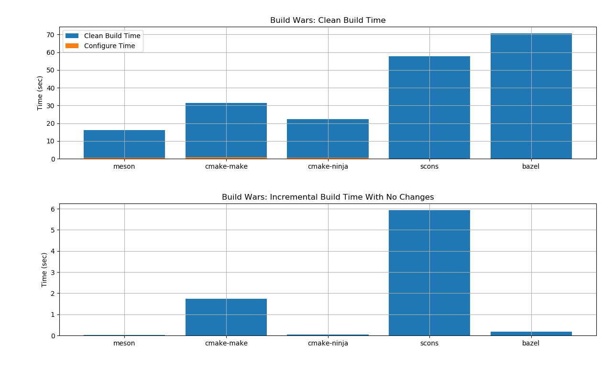

README
=======

The goal of this project is to compare build times (clean and incremental) for
various build tools for C/C++. The scripts used in this project were copied from
[here](https://mesonbuild.com/Simple-comparison.html#original-scripts) and then
modified to add bazel support among other things.


## Required Dependencies

```bash
    # bazel
    $ sudo apt-get install openjdk-8-jdk
    $ echo "deb [arch=amd64] http://storage.googleapis.com/bazel-apt stable jdk1.8" | sudo tee /etc/apt/sources.list.d/bazel.list
    $ curl https://bazel.build/bazel-release.pub.gpg | sudo apt-key add -
    $ sudo apt-get update && sudo apt-get install bazel

    # cmake
    $ sudo apt install cmake
    
    # scons
    $ sudo apt install scons

    # meson
    $ sudo apt install python3-pip
    $ sudo -H pip3 install meson
    
    # deps for plotting
    $ sudo apt install python3-pyqt4 python3-matplotlib python3-numpy
```

## Generate project

```bash
    $ ./gen_src.py bigproj
```

## Build and plot comparison

```bash
    $ ./measure.py bigproj
```

## Comparison

Here is the build time comparison for 2500 sources.


